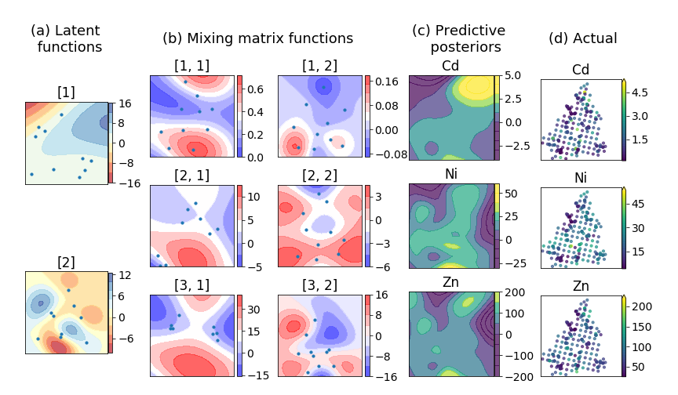
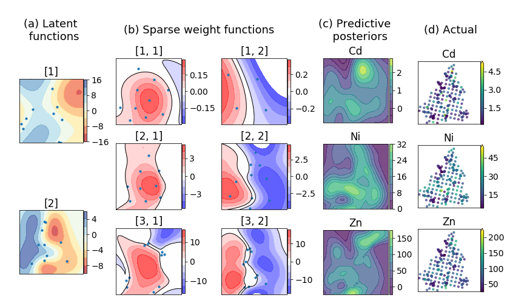

# gprn-svi
Implementation for Stochastic Variational Inference for the following models :

1. Gaussian Process Regression Netwroks (Wilson, 2011)
2. Sparse Gaussian Process Regression Netwroks

The main model is implemented in TensorFlow. However the supporting functions under onoffgp module have been cloned/inspired from GPflow(https://github.com/GPflow/)

**1. Gaussian Process Regression Netwroks (Wilson, 2011)**

GPRN framework by Wilson, 2012 (https://arxiv.org/abs/1110.4411) is an efficient model for multi-target regression problems, where each individual output is a linear but non-stationary combination of shared latent functions. The scalable SVI bound for this model has been derived in ...  Notebook 'gprn-jura.ipynb' illustrates variational inference on the Jura dataset.

**2. Sparse Gaussian Process Regression Netwroks**

Sparse GPRN framework is an extention to GPRN where each of the latent mixing functions are modeled to be sparse.  This makes the model more powerful and interpretable since each response can effectively use any subset of the latent dimensions by having exact zeros for the rest in the mixing functions. Notebook 'sgprn-jura.ipynb' illustrates variational inference for SGPRN model on the Jura dataset.

